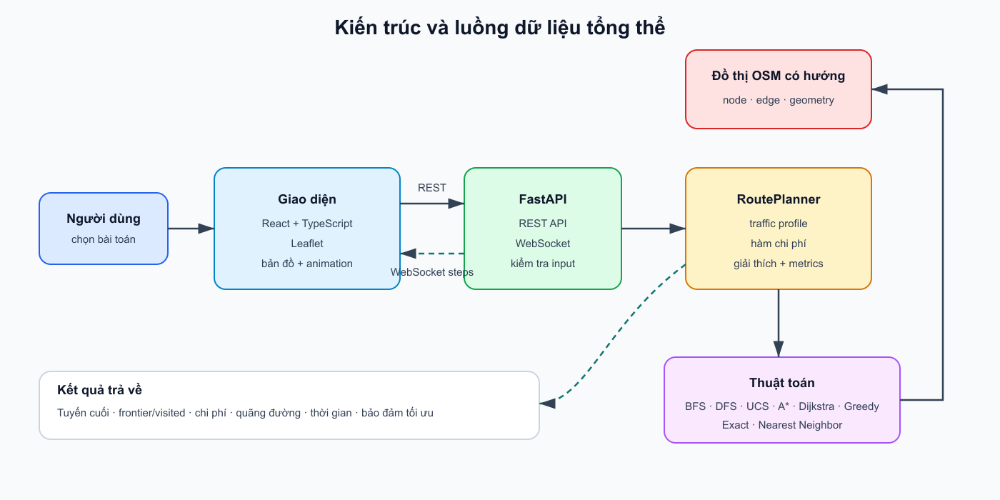
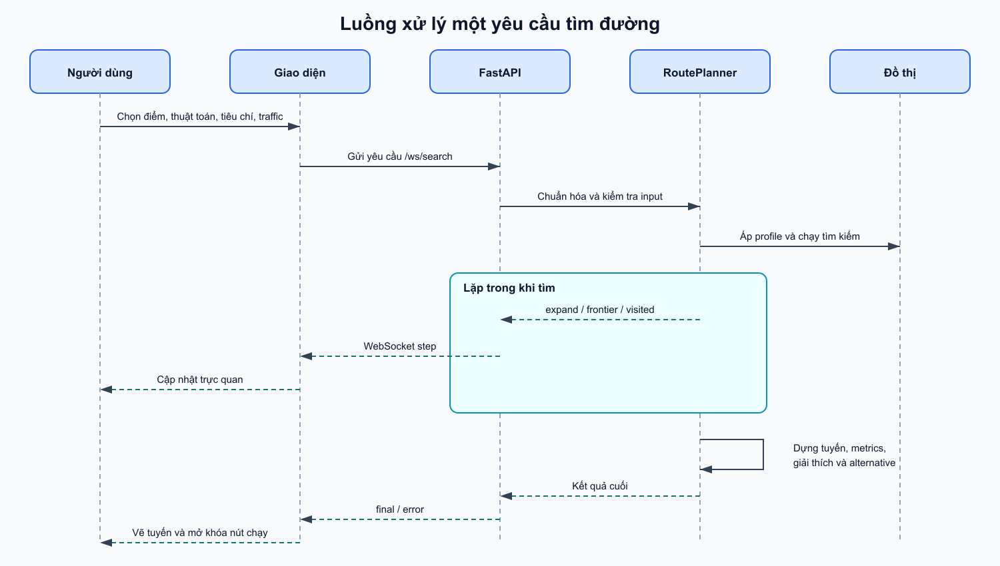
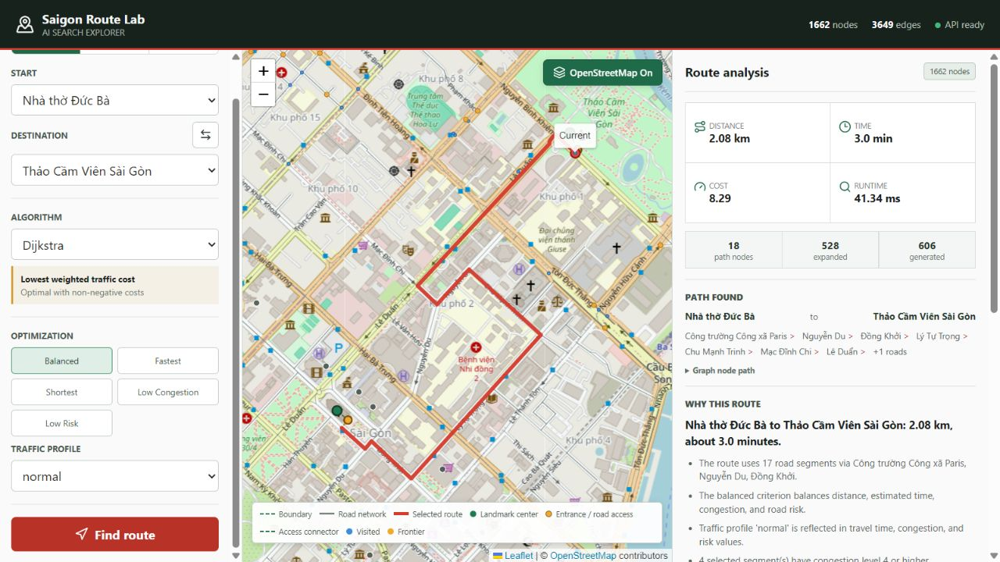
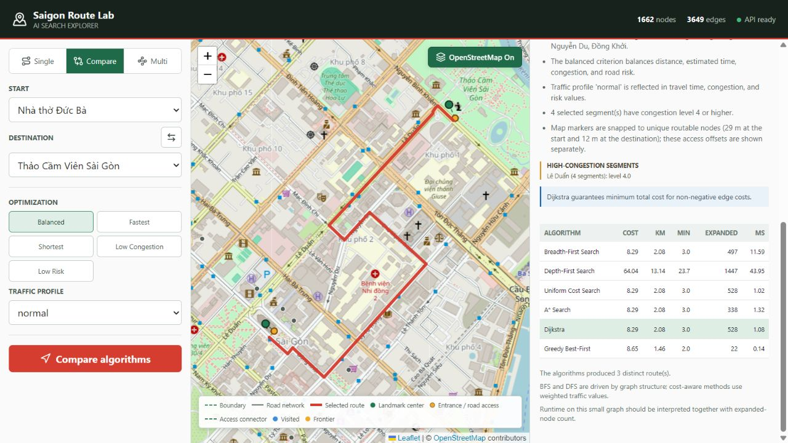
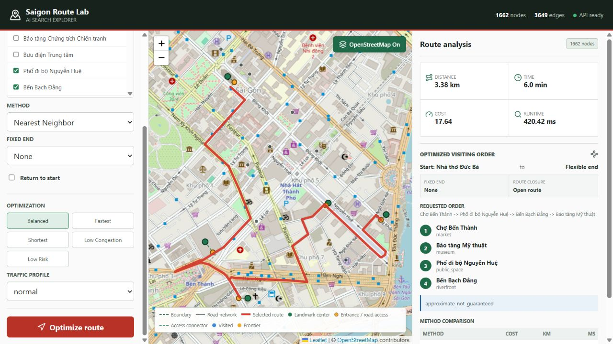

# BÁO CÁO KỸ THUẬT — SAIGON ROUTE LAB

> **Ghi chú về trang bìa:** Theo yêu cầu của người dùng, báo cáo này không tạo trang bìa. Khi xuất bản nộp bài, nhóm bổ sung trang bìa theo mẫu của môn học.

## Mục lục

1. [Danh sách hình vẽ](#danh-sách-hình-vẽ)
2. [Danh sách bảng](#danh-sách-bảng)
3. [1. Giới thiệu nhóm](#1-giới-thiệu-nhóm)
4. [2. Giới thiệu bài toán](#2-giới-thiệu-bài-toán)
5. [3. Mô hình hóa bài toán](#3-mô-hình-hóa-bài-toán)
6. [4. Dữ liệu và tiền xử lý](#4-dữ-liệu-và-tiền-xử-lý)
7. [5. Hàm chi phí và kịch bản giao thông](#5-hàm-chi-phí-và-kịch-bản-giao-thông)
8. [6. Các thuật toán tìm kiếm](#6-các-thuật-toán-tìm-kiếm)
9. [7. Heuristic và cơ sở bảo đảm của A\*](#7-heuristic-và-cơ-sở-bảo-đảm-của-a)
10. [8. Bài toán đi qua nhiều địa điểm](#8-bài-toán-đi-qua-nhiều-địa-điểm)
11. [9. Thiết kế và hiện thực chương trình](#9-thiết-kế-và-hiện-thực-chương-trình)
12. [10. Giao diện và khả năng giải thích](#10-giao-diện-và-khả-năng-giải-thích)
13. [11. Thực nghiệm và đánh giá](#11-thực-nghiệm-và-đánh-giá)
14. [12. Hướng dẫn cài đặt và sử dụng](#12-hướng-dẫn-cài-đặt-và-sử-dụng)
15. [13. Hạn chế và hướng phát triển](#13-hạn-chế-và-hướng-phát-triển)
16. [14. Kết luận](#14-kết-luận)
17. [Tài liệu tham khảo](#tài-liệu-tham-khảo)
18. [Phụ lục A — Đối chiếu yêu cầu đề bài](#phụ-lục-a--đối-chiếu-yêu-cầu-đề-bài)
19. [Phụ lục B — Tái lập kiểm chứng](#phụ-lục-b--tái-lập-kiểm-chứng)
20. [Phụ lục C — Tự chấm điểm](#phụ-lục-c--tự-chấm-điểm)
21. [Phụ lục D — Danh sách TODO](#phụ-lục-d--danh-sách-todo)

## Danh sách hình vẽ

- **Hình 1.** Kiến trúc và luồng dữ liệu tổng thể.
- **Hình 2.** Luồng xử lý một yêu cầu tìm đường.
- **Hình 3.** Chế độ tìm đường đơn trên giao diện hiện tại.
- **Hình 4.** Chế độ so sánh sáu thuật toán.
- **Hình 5.** Chế độ đi qua nhiều địa điểm.

## Danh sách bảng

- **Bảng 1.** Thông tin và phân công thành viên.
- **Bảng 2.** Ánh xạ mô hình đồ thị.
- **Bảng 3.** Thống kê bộ dữ liệu hiện tại.
- **Bảng 4.** Các bộ trọng số chi phí.
- **Bảng 5.** So sánh lý thuyết sáu thuật toán.
- **Bảng 6.** Diễn tiến ví dụ đồ thị nhỏ.
- **Bảng 7.** Kết quả benchmark sáu thuật toán.
- **Bảng 8.** Ảnh hưởng của kịch bản giao thông.
- **Bảng 9.** Kết quả bài toán nhiều địa điểm.
- **Bảng 10.** Tự chấm chất lượng bài viết.

---

## 1. Giới thiệu nhóm

### 1.1. Thông tin nhóm

**Bảng 1. Thông tin và phân công được ghi nhận trong metadata/tài liệu dự án**

| STT | Họ và tên | MSSV | Phần việc chính | Hoàn thành phần được giao* |
|---:|---|---:|---|---:|
| 1 | Nguyễn Huy Hoàng | 24127378 | BFS, bối cảnh Việt Nam, phần giới thiệu | 100% |
| 2 | Nguyễn Đăng Hậu | 24127167 | DFS, đồ thị, dữ liệu, hàm chi phí | 100% |
| 3 | Nguyễn Thành Trung | 24127257 | UCS, giải thích tuyến, phân tích thuật toán | 100% |
| 4 | Phùng Bảo Khang | 24127052 | A*, heuristic, GUI và trực quan hóa | 100% |
| 5 | Thái Kiệt | 24127069 | Dijkstra, Greedy, bài toán nhiều địa điểm | 100% |

Nhóm số **1**, gồm năm thành viên. Thông tin trên được lấy từ `docs/group_metadata.json` và đối chiếu với tài liệu dự án. Dấu `*` cho biết tỷ lệ 100% là mức nhóm ghi nhận cho **phần việc đã phân công**, có hiện vật tương ứng trong repository; báo cáo không tuyên bố đã xác minh độc lập mức đóng góp cá nhân và không thay thế việc giảng viên phỏng vấn từng thành viên.

### 1.2. Tình trạng hoàn thành

Repository hiện có đủ sáu thuật toán, ba phương pháp nhiều địa điểm, backend, frontend, trực quan hóa theo bước, giải thích tuyến, dữ liệu OSM và kiểm thử. Ở lần xác minh cuối cho báo cáo này:

- backend đạt **77/77** kiểm thử;
- frontend đạt **25/25** kiểm thử và build production thành công;
- giao diện nạp đúng **1.662 đỉnh**, **3.649 cạnh có hướng** và **24 địa danh**;
- console trình duyệt không ghi nhận lỗi hoặc cảnh báo trong ba luồng thao tác chính.

Các kết quả trên chỉ phản ánh trạng thái mã nguồn tại thời điểm kiểm tra, không phải cam kết rằng hệ thống giao thông thực tế luôn giống mô phỏng.

---

## 2. Giới thiệu bài toán

### 2.1. Bối cảnh

Bài toán của nhóm là tìm tuyến tham quan giữa các địa danh ở khu vực trung tâm Thành phố Hồ Chí Minh. Đây là một ngữ cảnh giao thông cụ thể: đường có chiều, tốc độ giả định theo loại đường, mức ùn tắc và rủi ro; điểm xuất phát/đích là địa danh thật; kết quả là chuỗi đoạn đường có tên và hình học để hiển thị trên bản đồ. Vì vậy, hệ thống không coi bản đồ như một mê cung trừu tượng.

Một địa danh lớn thường có hai tọa độ khác nhau về mục đích:

1. **Tọa độ hiển thị** đại diện cho vị trí/khối công trình trên bản đồ.
2. **Tọa độ truy cập định tuyến** đại diện cho cổng hoặc điểm tiếp cận gần mạng đường xe chạy.

Sự phân biệt này xử lý trực tiếp lỗi thường gặp: chấm địa danh nằm giữa khuôn viên nhưng tuyến kết thúc ở một góc đường khó hiểu. Trong hệ thống, marker xanh biểu diễn địa danh, còn marker/đường nối truy cập cho biết nơi thuật toán thực sự bắt đầu hoặc kết thúc.

### 2.2. Mục tiêu

Hệ thống phải trả lời được hai nhóm câu hỏi:

- **Hai địa điểm:** từ địa danh A đến B, thuật toán nào tìm được tuyến; tuyến có chi phí, quãng đường, thời gian và mức tác động giao thông ra sao?
- **Nhiều địa điểm:** với một điểm xuất phát và danh sách điểm cần ghé, thứ tự nào tốt hơn theo cùng hàm chi phí?

Ngoài việc trả về đường đi, hệ thống phải giúp người học quan sát quá trình tìm kiếm: tập đã thăm, frontier, thứ tự mở rộng, tuyến cuối, số đỉnh sinh/mở rộng và thời gian chạy. Mục tiêu học thuật là so sánh hành vi và bảo đảm của thuật toán, không chỉ tạo một ứng dụng bản đồ.

### 2.3. Phạm vi và giả định

- Mạng đường là ảnh chụp dữ liệu OSM đã tải về, không phải luồng giao thông trực tiếp.
- Thời gian, ùn tắc và rủi ro là giá trị mô hình hóa có kiểm soát; không phải đo đạc hiện trường.
- Tuyến đường dành cho mạng `drive`; hệ thống không khẳng định phù hợp cho người đi bộ, phương tiện công cộng hoặc xe chuyên dụng.
- Mọi trọng số đều không âm, là điều kiện quan trọng cho UCS, Dijkstra và A*.
- Kết quả định tuyến là kết quả của mô hình trong phạm vi dữ liệu, không phải chỉ dẫn giao thông pháp lý.

---

## 3. Mô hình hóa bài toán

### 3.1. Đồ thị có hướng

Mạng giao thông được biểu diễn bởi đồ thị có hướng có trọng số:

$$
G=(V,E).
$$

**Bảng 2. Ánh xạ từ giao thông sang đồ thị**

| Thành phần | Biểu diễn | Thuộc tính chính |
|---|---|---|
| Giao lộ/điểm mạng đường | Đỉnh $v\in V$ | ID OSM, vĩ độ, kinh độ |
| Đoạn đường có chiều | Cạnh $e=(u,v)\in E$ | chiều dài, thời gian, ùn tắc, rủi ro, loại/tên đường, hình học, `oneway` |
| Địa danh | Bản ghi POI | tọa độ hiển thị, tọa độ truy cập, đỉnh mạng được gắn |
| Trạng thái tìm kiếm | Đỉnh hiện tại | parent, $g$, $h$, frontier/closed tùy thuật toán |
| Hành động | Đi theo một cạnh hợp lệ | chỉ theo chiều cạnh trong đồ thị |
| Trạng thái đầu/đích | Đỉnh truy cập của địa danh | ánh xạ từ ID địa danh sang node mạng |

Đồ thị có hướng giữ được đường một chiều và hai hướng không nhất thiết có cùng thuộc tính. Một đoạn OSM có nhiều bản ghi song song được chuẩn hóa để thuật toán làm việc trên cạnh hợp lệ có chi phí tốt nhất giữa cặp đỉnh tương ứng.

### 3.2. Không gian trạng thái và nghiệm

Với bài toán hai điểm, trạng thái đầu là $s$, trạng thái đích là $t$. Một nghiệm là đường đi:

$$
P=\langle v_0=s,v_1,\ldots,v_k=t\rangle,
\quad (v_i,v_{i+1})\in E.
$$

Chi phí đường đi là tổng chi phí các cạnh:

$$
C(P)=\sum_{i=0}^{k-1} c(v_i,v_{i+1}).
$$

Với bài toán nhiều địa điểm, ngoài đường đi trên đồ thị còn có một lớp quyết định thứ tự ghé các waypoint. Phần 8 trình bày rõ cách rút gọn bài toán này về ma trận chi phí ngắn nhất giữa các địa danh.

### 3.3. Điều kiện dừng và trường hợp không có đường

- BFS/DFS dừng khi lấy đích ra khỏi cấu trúc frontier.
- UCS/Dijkstra/A* dừng khi đích được lấy ra với nhãn ưu tiên tốt nhất đã xác lập.
- Greedy dừng khi lấy đích ra khỏi hàng đợi ưu tiên heuristic.
- Nếu frontier rỗng trước khi gặp đích, hệ thống trả trạng thái không tìm thấy đường thay vì chạy vô hạn.

Trên dữ liệu hiện tại, kiểm toán 552 cặp có thứ tự giữa 24 địa danh cho thấy cả **552/552** cặp đều có đường. Kết quả này là bằng chứng thực nghiệm cho dataset hiện tại; xử lý “không có đường” vẫn được giữ trong mã để an toàn với dataset khác.

---

## 4. Dữ liệu và tiền xử lý

### 4.1. Nguồn dữ liệu

Dữ liệu đường được lấy từ **OpenStreetMap contributors** thông qua OSMnx 2.1.1, với loại mạng `drive`. OpenStreetMap công bố dữ liệu theo ODbL và yêu cầu ghi công; báo cáo và giao diện cần duy trì attribution phù hợp [7], [8]. OSMnx là thư viện chính thức được dùng để tải và mô hình hóa mạng đường từ OSM [9], [10].

Phạm vi tải là bounding box liên tục bao quanh tập địa danh, nới thêm 600 m:

$$
[106.6767133,\ 10.7645721,\ 106.7115867,\ 10.7959279].
$$

Tệp nguồn và dấu vết tái lập nằm trong:

- `lab-1-backend/data/osm/nodes.geojson`;
- `lab-1-backend/data/osm/roads.geojson`;
- `lab-1-backend/data/osm/summary.json`;
- `lab-1-backend/data/landmarks.json`.

### 4.2. Thống kê dữ liệu

**Bảng 3. Thống kê bộ dữ liệu ở lần kiểm tra cuối**

| Chỉ số | Giá trị |
|---|---:|
| Node/giao điểm trong dữ liệu tải | 1.713 |
| Road feature trong dữ liệu tải | 3.740 |
| Tổng chiều dài hình học đường có hướng | 331,591 km |
| Đỉnh định tuyến sau chuẩn hóa | 1.662 |
| Cạnh có hướng sau chuẩn hóa | 3.649 |
| Địa danh | 24 |
| Đỉnh địa danh duy nhất | 24 |
| Connector mô phỏng | 0 |
| Cặp địa danh có thứ tự kiểm tra | 552 |
| Cặp đi được | 552 |

Quy mô này vượt yêu cầu tối thiểu 20 đỉnh và 30 cạnh của đề. Không có connector mô phỏng trong đồ thị cuối; địa danh được gắn vào node đường thật thông qua điểm truy cập.

### 4.3. Tập địa danh

Dataset gồm 24 địa danh: Chợ Bến Thành; Dinh Độc Lập; Bảo tàng Chứng tích Chiến tranh; Nhà thờ Đức Bà; Bưu điện Trung tâm; Phố đi bộ Nguyễn Huệ; Bến Bạch Đằng; Nhà hát Thành phố; Bảo tàng Thành phố Hồ Chí Minh; Công viên Tao Đàn; Đường sách Thành phố Hồ Chí Minh; Vincom Center Đồng Khởi; Saigon Centre; Bitexco Financial Tower; Công viên Lê Văn Tám; Bảo tàng Mỹ thuật; Nhà thờ Tân Định; Bảo tàng Phụ nữ Nam Bộ; Hồ Con Rùa; Diamond Plaza; Thảo Cầm Viên Sài Gòn; Trụ sở Ủy ban Nhân dân Thành phố; Chùa Vĩnh Nghiêm; Nhà Văn hóa Thanh niên.

Phân bố nhãn dữ liệu: 5 kiến trúc, 4 văn hóa, 4 bảo tàng, 3 công viên, 3 mua sắm, 2 không gian công cộng, 1 di tích, 1 chợ và 1 ven sông. Nhãn chỉ phục vụ mô tả/hiển thị; thuật toán định tuyến không ưu tiên địa danh theo loại.

### 4.4. Điểm truy cập của địa danh

Mỗi bản ghi có `latitude/longitude` để hiển thị và `routing_latitude/routing_longitude` để gắn mạng. Có 12 ghi đè truy cập được tuyển chọn; các trường hợp còn lại dùng điểm tiếp cận đường xe chạy gần nhất. Ví dụ:

- Chợ Bến Thành: Cửa Nam, gần Công trường Quách Thị Trang (OSM node 2893838360).
- Dinh Độc Lập: cổng xe trên đường Nam Kỳ Khởi Nghĩa (OSM node 5403245162).
- Nhà thờ Đức Bà: lối chính tại Công trường Công xã Paris (OSM node 7501051348).
- Bưu điện Trung tâm: điểm phía mặt tiền Công trường Công xã Paris được tuyển chọn thủ công.
- Công viên Tao Đàn: cổng sát đường Cách Mạng Tháng Tám (OSM node 13306234429).

Độ lệch từ điểm truy cập đến node định tuyến có trung bình **8,02 m**, lớn nhất **29,9 m**, và không có trường hợp nào vượt 100 m. Các con số này được tính từ dữ liệu dự án. Chúng chứng minh phép snap gần mạng đường, nhưng **không đồng nghĩa mọi điểm đều là “cổng chính thức” đã được cơ quan quản lý xác nhận**. Vì OSM có thể thay đổi, trường `access_source` cần được tái kiểm tra nếu tải lại dữ liệu.

### 4.5. Tiền xử lý và kiểm soát chất lượng

Quy trình:

1. tải mạng `drive` liên tục quanh toàn bộ địa danh;
2. đọc node, cạnh, hình học và metadata OSM;
3. chuẩn hóa tên/loại đường, tốc độ mặc định và hướng cạnh;
4. tính chiều dài km, thời gian phút, mức ùn tắc và rủi ro cơ sở;
5. gắn từng địa danh vào node gần tọa độ truy cập;
6. kiểm tra ID, số hữu hạn, trọng số không âm và tính đi được;
7. xuất summary và chạy kiểm toán toàn bộ cặp.

Rủi ro dữ liệu chính là OSM thiếu lối vào, tên đường không đồng nhất hoặc lỗi mã hóa tiếng Việt. Biện pháp hiện tại là lưu nguồn truy cập theo từng địa danh, hiển thị riêng marker trung tâm/điểm vào và có bài kiểm toán khoảng cách snap.

---

## 5. Hàm chi phí và kịch bản giao thông

### 5.1. Hàm chi phí nhiều tiêu chí

Đề bài yêu cầu chi phí không chỉ là khoảng cách. Mỗi cạnh dùng:

$$
c(e)=\alpha d(e)+\beta t(e)+\gamma q(e)+\delta r(e),
$$

trong đó:

- $d(e)$: chiều dài cạnh theo km;
- $t(e)$: thời gian ước lượng theo phút;
- $q(e)$: mức ùn tắc không thứ nguyên;
- $r(e)$: mức rủi ro không thứ nguyên;
- $\alpha,\beta,\gamma,\delta\ge 0$: trọng số do tiêu chí lựa chọn.

Thời gian cơ sở được tính từ chiều dài và tốc độ mặc định theo loại đường:

$$
t(e)=\frac{d(e)}{v(e)}\times 60.
$$

Các tốc độ, ùn tắc và rủi ro là **giả định mô phỏng của dự án**, không phải dữ liệu cảm biến. Mục đích của chúng là tạo môi trường lặp lại được để so sánh thuật toán.

### 5.2. Các bộ trọng số

**Bảng 4. Các bộ trọng số hiện thực trong hệ thống**

| Tiêu chí | $\alpha$ khoảng cách | $\beta$ thời gian | $\gamma$ ùn tắc | $\delta$ rủi ro | Ý nghĩa |
|---|---:|---:|---:|---:|---|
| Cân bằng | 1,00 | 0,40 | 0,08 | 0,12 | Không ưu tiên tuyệt đối một yếu tố |
| Nhanh nhất | 0,20 | 1,20 | 0,04 | 0,08 | Nhấn mạnh phút di chuyển |
| Ngắn nhất | 1,50 | 0,05 | 0,01 | 0,03 | Nhấn mạnh km |
| Ít ùn tắc | 0,70 | 0,30 | 0,25 | 0,15 | Phạt đoạn có congestion cao |
| Ít rủi ro | 0,50 | 0,30 | 0,08 | 0,80 | Phạt đoạn có risk cao |

Đơn vị của tổng chi phí là “điểm chi phí mô hình”, không phải km hay phút. Vì các đại lượng có thang đo khác nhau, thay trọng số có thể thay tuyến. Kiểm toán 552 cặp ghi nhận **351 cặp** đổi tuyến khi đổi tiêu chí; điều này cho thấy các preset có ảnh hưởng thực, không chỉ đổi nhãn giao diện.

### 5.3. Kịch bản giao thông

Ba profile được áp dụng trước khi tìm kiếm:

- **Bình thường:** giữ nguyên thời gian, congestion, risk cơ sở.
- **Giờ cao điểm:** tăng thời gian theo congestion và loại đường; tăng congestion tối đa đến 5.
- **Trời mưa:** tăng thời gian theo risk, tăng congestion 0,4 và risk 1,2, đều chặn ở 5.

Các phép biến đổi là xác định, nên cùng input cho cùng output. Kiểm toán toàn bộ cặp ghi nhận **82 cặp** đổi tuyến khi đổi profile. Đây là bằng chứng rằng giao thông mô phỏng tác động đến quyết định. Không nên diễn giải chúng như dự báo giao thông trực tiếp.

---

## 6. Các thuật toán tìm kiếm

### 6.1. Tổng quan lý thuyết

Các định nghĩa BFS/DFS được đối chiếu với Dictionary of Algorithms and Data Structures của NIST [2], [3]; Dijkstra theo công trình gốc năm 1959 [4]; A* theo Hart, Nilsson và Raphael [5].

**Bảng 5. So sánh lý thuyết sáu thuật toán trong hiện thực này**

| Thuật toán | Frontier/ưu tiên | Đầy đủ trên đồ thị hữu hạn | Tối ưu theo chi phí $c$ | Thời gian xấu nhất | Bộ nhớ phụ |
|---|---|---|---|---|---|
| BFS | FIFO | Có nếu có tập visited | Không; chỉ tối ưu số cạnh | $O(V+E)$ | $O(V)$ |
| DFS | Stack | Có nếu có tập visited | Không | $O(V+E)$ | $O(V)$ |
| UCS | nhỏ nhất $g$ | Có với chi phí không âm và đồ thị hữu hạn | Có | $O((V+E)\log V)$ | $O(V)$ |
| A* | nhỏ nhất $f=g+h$ | Có trong điều kiện hiện tại | Có nếu $h$ nhất quán | xấu nhất $O((V+E)\log V)$ | $O(V)$ |
| Dijkstra | nhỏ nhất khoảng cách từ nguồn | Có | Có với cạnh không âm | $O((V+E)\log V)$ | $O(V)$ |
| Greedy | nhỏ nhất $h$ | Có trong hiện thực có closed set trên đồ thị hữu hạn | Không | xấu nhất $O((V+E)\log V)$ | $O(V)$ |

Độ phức tạp của các thuật toán ưu tiên giả định heap nhị phân; hằng số thời gian và thứ tự duyệt phụ thuộc hiện thực. “Đầy đủ” ở đây có nghĩa tìm được một đường nếu tồn tại trong đồ thị hữu hạn đang xét, không phải bảo đảm trên không gian vô hạn.

### 6.2. Breadth-First Search (BFS)

BFS mở rộng theo độ sâu tăng dần bằng hàng đợi FIFO. Khi gặp một đỉnh lần đầu, thuật toán gán parent và không đưa lại vào frontier. Vì mỗi lần tiến qua đúng một cạnh, BFS tối ưu **số cạnh**, nhưng không tối ưu hàm chi phí có độ dài/thời gian/ùn tắc/rủi ro.

Điểm mạnh là nguyên lý đơn giản, dễ trực quan hóa và là baseline không thông tin. Điểm yếu là có thể mở rộng nhiều node và chọn tuyến nhiều chi phí chỉ vì tuyến đó có ít đoạn hơn.

### 6.3. Depth-First Search (DFS)

DFS dùng stack và đi sâu theo nhánh trước. `visited/closed` ngăn chu trình làm thuật toán chạy mãi. Kết quả nhạy với thứ tự kề; tuyến đầu tiên gặp đích không có bảo đảm về số cạnh hoặc chi phí.

DFS hữu ích để minh họa ảnh hưởng của chiến lược frontier và kiểm tra khả năng đi được, nhưng không phải lựa chọn phù hợp khi mục tiêu là tuyến giao thông tốt nhất.

### 6.4. Uniform Cost Search (UCS)

UCS ưu tiên tổng chi phí tích lũy $g(n)$. Khi tìm được đường rẻ hơn tới một node, thuật toán cập nhật nhãn và parent. Với chi phí cạnh không âm, lúc đích được pop với nhãn tốt nhất, đường thu được là tối ưu.

Trong bài toán một nguồn–một đích, UCS và Dijkstra có thể có cùng thứ tự mở rộng. Dự án vẫn tách hai lớp để làm rõ cách trình bày trong AI search và khả năng tái sử dụng single-source của Dijkstra ở bài toán nhiều điểm.

### 6.5. A* Search

A* ưu tiên:

$$
f(n)=g(n)+h(n).
$$

Trong đó $g$ là chi phí đã đi và $h$ ước lượng phần còn lại. Nếu heuristic có thông tin, A* thường mở rộng ít node hơn UCS; nếu $h=0$, hành vi trở về UCS. Bảo đảm tối ưu của dự án được phân tích ở phần 7, không chỉ giả định.

### 6.6. Dijkstra

Dijkstra dùng nhãn khoảng cách/chi phí nhỏ nhất từ một nguồn và heap. Với cạnh không âm, thuật toán cho đường ngắn nhất theo hàm chi phí đã chọn [4]. Helper single-source tạo cây đường đi từ một địa danh tới nhiều địa danh khác, hữu ích khi lập ma trận chi phí cho bài toán nhiều điểm.

### 6.7. Greedy Best-First Search

Greedy chỉ ưu tiên $h(n)$, bỏ qua chi phí đã trả $g(n)$. Nó có thể tiến nhanh về mặt hình học nhưng đi vào nhánh đắt. Vì vậy, hệ thống ghi rõ `not_guaranteed` và dùng Greedy như thuật toán bổ sung để so sánh, không tuyên bố tối ưu.

### 6.8. Ví dụ minh họa do nhóm thiết kế

Xét đồ thị:

```text
             8                 1
        A --------> B ----------------> G
        |
      1 |
        v
        C --------> D ----------------> G
             1                 1
```

Thứ tự kề tại A là B rồi C. Heuristic đến G: $h(A)=2,h(B)=0,h(C)=2,h(D)=1,h(G)=0$. Có hai tuyến: A–B–G gồm 2 cạnh, chi phí 9; A–C–D–G gồm 3 cạnh, chi phí 3.

**Bảng 6. Kết quả trên ví dụ nhỏ**

| Thuật toán | Thứ tự mở rộng tiêu biểu | Tuyến | Chi phí | Nhận xét |
|---|---|---|---:|---|
| BFS | A, B, C, G | A–B–G | 9 | tối ưu số cạnh |
| DFS | A, B, G | A–B–G | 9 | phụ thuộc thứ tự kề |
| UCS | A(0), C(1), D(2), G(3) | A–C–D–G | 3 | tối ưu chi phí |
| A* | A, C, D, G | A–C–D–G | 3 | heuristic hợp lệ |
| Dijkstra | A(0), C(1), D(2), G(3) | A–C–D–G | 3 | tối ưu chi phí |
| Greedy | A, B, G | A–B–G | 9 | bị hấp dẫn bởi $h(B)=0$ |

Ví dụ này tách rõ “ít cạnh”, “đi sâu”, “rẻ nhất” và “trông có vẻ gần đích”. Fixture tương ứng có trong kiểm thử dự án để tránh ví dụ chỉ tồn tại trên giấy.

---

## 7. Heuristic và cơ sở bảo đảm của A*

### 7.1. Định nghĩa

Heuristic cơ sở là khoảng cách cung lớn Haversine giữa node hiện tại và đích:

$$
d_H=2R\arcsin\sqrt{\sin^2\frac{\Delta\varphi}{2}+
\cos\varphi_1\cos\varphi_2\sin^2\frac{\Delta\lambda}{2}},
$$

với $R=6371{,}0088$ km. A* dùng:

$$
h(n)=\alpha d_H(n,t).
$$

Chỉ hệ số khoảng cách $\alpha$ được dùng; các thành phần thời gian, ùn tắc và rủi ro không được “đoán” thêm. Cách này bảo thủ nhưng giúp chứng minh tính hợp lệ.

### 7.2. Tính chấp nhận được

Với mọi cạnh, chiều dài đường thực không nhỏ hơn khoảng cách thẳng giữa hai đầu; các thành phần còn lại và trọng số đều không âm. Do đó:

$$
c(e)\ge \alpha d(e)\ge \alpha d_H(u,v).
$$

Theo bất đẳng thức tam giác, khoảng cách thẳng từ node đến đích không vượt tổng chiều dài của bất kỳ đường đi nào. Vì vậy $h(n)\le h^*(n)$: heuristic không đánh giá quá chi phí còn lại và là **admissible**.

### 7.3. Tính nhất quán

Với cạnh $(u,v)$:

$$
h(u)=\alpha d_H(u,t)
\le \alpha d_H(u,v)+\alpha d_H(v,t)
\le c(u,v)+h(v).
$$

Do đó heuristic là **consistent**. Hệ quả là A* graph-search không cần chấp nhận một lời giải đích chưa tối ưu; khi đích được lấy ra theo $f$, đường đi tối ưu theo $c$ đã được xác lập.

### 7.4. Kiểm toán thực nghiệm

Ngoài chứng minh, script kiểm toán kiểm tra tất cả:

- 5 preset trọng số;
- 24 đích;
- 3.649 cạnh có hướng.

Tổng cộng 5 × 24 × 3.649 phép kiểm tra cạnh–đích, không phát hiện vi phạm nhất quán; độ vượt lớn nhất bằng 0 trong sai số tính toán của lần chạy. Đồng thời UCS, A* và Dijkstra có **0 sai khác tối ưu** trên 552 cặp địa danh, sai lệch chi phí lớn nhất bằng 0.

Kết quả thực nghiệm hỗ trợ hiện thực, còn chứng minh ở trên mới là cơ sở tổng quát trong các giả định của mô hình.

---

## 8. Bài toán đi qua nhiều địa điểm

### 8.1. Phát biểu

Input gồm điểm xuất phát $s$ và tập $K=\{k_1,\ldots,k_m\}$ cần ghé. Hệ thống cần tìm một hoán vị $\pi$ để giảm:

$$
C(s,k_{\pi_1})+\sum_{i=1}^{m-1}C(k_{\pi_i},k_{\pi_{i+1}}).
$$

Đây là đường đi mở: không bắt buộc quay về điểm xuất phát. $C(a,b)$ là chi phí đường đi tối ưu trên đồ thị đường, tính bằng Dijkstra theo profile và tiêu chí đã chọn.

### 8.2. Tiền tính chi phí cặp

Hệ thống chạy Dijkstra single-source từ mỗi địa danh quan trọng, lưu chi phí và parent để dựng lại từng đoạn. Nhờ đó, tầng tối ưu thứ tự làm việc trên ma trận chi phí nhỏ thay vì gọi lại tìm kiếm cho mọi hoán vị. Tuyến cuối là phép nối hình học của các đoạn, loại node trùng ở ranh giới.

### 8.3. Exact brute force

Phương pháp chính xác duyệt mọi $m!$ hoán vị, tính tổng chi phí và chọn nhỏ nhất. Đây là exhaustive search theo nghĩa thử toàn bộ ứng viên [6]. Bảo đảm của dự án là:

> tối ưu đối với bài toán thứ tự rút gọn trên ma trận chi phí cặp hiện tại.

Nó không phải lời giải hiệu quả cho số waypoint lớn vì tăng trưởng giai thừa. GUI giới hạn quy mô phù hợp cho demo/lab.

### 8.4. Nearest Neighbor

Từ vị trí hiện tại, thuật toán chọn waypoint chưa thăm có chi phí cặp nhỏ nhất, lặp đến hết. Sau khi đã có ma trận, phần chọn thứ tự tốn $O(m^2)$. Nearest Neighbor nhanh và dễ giải thích nhưng **không bảo đảm tối ưu**; các phân tích kinh điển về heuristic này cho TSP được trình bày bởi Rosenkrantz, Stearns và Lewis [11].

Hệ thống luôn gắn nhãn `approximate_not_guaranteed` và khi có thể sẽ so với exact để hiển thị gap. Việc một test case cho gap 0% chỉ có nghĩa heuristic tình cờ đạt cùng nghiệm trong case đó.

---

## 9. Thiết kế và hiện thực chương trình

### 9.1. Kiến trúc



**Hình 1. Kiến trúc và luồng dữ liệu tổng thể.**

Backend dùng FastAPI; tài liệu chính thức mô tả đây là framework API Python và hỗ trợ WebSocket [12], [13]. Frontend dùng React [14] và Leaflet 1.9.4 [15]. Các tài liệu chính thức này chỉ xác nhận API/công nghệ; mọi tuyên bố về hành vi dự án được kiểm chứng từ mã và test nội bộ.

### 9.2. Cấu trúc module

- `lab-1-backend/app/main.py`: khai báo API và WebSocket.
- `lab-1-backend/app/application.py`: orchestration, nạp graph và thực thi use case.
- `lab-1-backend/core/graph.py`: mô hình node/cạnh và thao tác graph.
- `lab-1-backend/core/costs.py`: hàm chi phí, preset và profile giao thông.
- `lab-1-backend/core/algorithms/`: sáu thuật toán tìm kiếm.
- `lab-1-backend/core/multi_location.py`: ma trận cặp, exact brute force và nearest neighbor.
- `lab-1-backend/core/explanation.py`: diễn giải tuyến và tuyến thay thế.
- `lab-1-frontend/src/App.tsx`: state và luồng tương tác chính.
- `lab-1-frontend/src/api.ts`: REST/WebSocket, timeout và hủy request cũ.
- `lab-1-frontend/src/components/MapView.tsx`: bản đồ, marker, polyline và animation.
- `lab-1-frontend/src/components/ResultsPanel.tsx`: metrics, giải thích, so sánh.

### 9.3. Luồng một yêu cầu



**Hình 2. Luồng xử lý một yêu cầu tìm đường.**

Để tránh nút “Running” quay vô hạn, frontend quản lý vòng đời request bằng `AbortController`, timeout 30 giây, hủy yêu cầu cũ khi có yêu cầu mới và xử lý đầy đủ nhánh `final`, `error`, đóng socket. Đây là cơ chế kỹ thuật; người dùng vẫn cần xem log nếu backend bị tắt hoặc mạng bị chặn.

### 9.4. API

| Endpoint | Vai trò |
|---|---|
| `GET /api/health` | kiểm tra backend |
| `GET /api/bootstrap` | landmark, preset, metadata ban đầu |
| `GET /api/network` | hình học mạng để hiển thị |
| `POST /api/search` | tìm đường hai điểm |
| `POST /api/compare` | chạy sáu thuật toán cùng input |
| `POST /api/multi-route` | tối ưu nhiều điểm |
| `WS /ws/search` | phát bước tìm kiếm và kết quả cuối |

Mỗi WebSocket step hiện tương ứng đúng **một lần mở rộng node**, nên nút **Next** tiến đúng một bước thuật toán. Thay vì gửi lặp lại toàn bộ visited, backend chỉ gửi `visited_delta` chứa node vừa mở rộng; frontend tích lũy các delta để replay nên node cũ không biến mất khi tiến hoặc lùi. Frontier vẫn được gửi dưới dạng snapshot tối đa 80 phần tử vì tập này có thể thêm, xóa và đổi priority giữa hai bước. Sau khi nhận `complete`, các lần bấm Next chỉ thay đổi chỉ số local và không gọi backend.

---

## 10. Giao diện và khả năng giải thích

### 10.1. Điều khiển

Người dùng có thể chọn:

- điểm đầu, điểm cuối hoặc danh sách waypoint;
- BFS, DFS, UCS, A*, Dijkstra, Greedy;
- tiêu chí cân bằng/nhanh/ngắn/ít ùn tắc/ít rủi ro;
- profile bình thường/giờ cao điểm/trời mưa;
- chế độ chạy đơn, so sánh hoặc nhiều địa điểm;
- tốc độ/tiến trình trực quan theo khả năng giao diện.

### 10.2. Bản đồ và trạng thái

Leaflet hiển thị mạng đường, địa danh, điểm truy cập, toàn bộ visited đã tích lũy đến bước đang chọn, cửa sổ frontier và polyline của tuyến cuối. Việc tách marker địa danh với điểm truy cập giúp giải thích vì sao tuyến kết thúc cạnh cổng thay vì giữa công trình. Người dùng có thể bật thang màu xanh–vàng–đỏ để xem mức congestion/risk mô phỏng của từng cạnh theo traffic profile; chú thích giao diện nêu rõ đây không phải dữ liệu giao thông thời gian thực.



**Hình 3. Chế độ tìm đường đơn hiện tại: Dijkstra từ Nhà thờ Đức Bà đến Thảo Cầm Viên, kèm chi phí, quãng đường, thời gian và số node.**



**Hình 4. Chế độ so sánh sáu thuật toán trên cùng input.**



**Hình 5. Chế độ nhiều địa điểm, hiển thị thứ tự ghé và tuyến ghép.**

Ba ảnh được chụp lại từ phiên bản hiện tại sau khi backend/frontend chạy thành công; không dùng ảnh cũ có thống kê graph lỗi thời.

### 10.3. Giải thích tuyến

Kết quả không chỉ trả mảng node. Phần giải thích gồm:

- tiêu chí và profile đã chọn;
- tổng chi phí, khoảng cách, thời gian;
- các đoạn/tên đường chính;
- đoạn có tác động congestion/risk đáng chú ý;
- tuyến thay thế khi tìm được;
- nhãn bảo đảm tối ưu phù hợp với thuật toán;
- số node mở rộng, số node sinh và thời gian chạy.

Ngôn ngữ giải thích phải phân biệt “tối ưu theo hàm chi phí mô hình” với “tốt nhất trong giao thông thật”. BFS được ghi tối ưu theo số cạnh; Greedy/DFS không bảo đảm; exact chỉ tối ưu trên bài toán thứ tự rút gọn.

---

## 11. Thực nghiệm và đánh giá

### 11.1. Phương pháp

Benchmark được chạy trên trạng thái repository dùng cho báo cáo, không lấy số liệu chép từ báo cáo cũ. Mỗi thuật toán ở case chính chạy 10 lần; bảng ghi median thời gian. Thời gian rất nhỏ dễ bị ảnh hưởng bởi máy, cache và tiến trình nền, nên chỉ dùng để mô tả lần chạy này; số node mở rộng và chi phí đáng tin cậy hơn để so sánh hành vi.

Case chính:

- nguồn: Nhà thờ Đức Bà;
- đích: Thảo Cầm Viên Sài Gòn;
- tiêu chí: cân bằng;
- giao thông: bình thường.

### 11.2. So sánh sáu thuật toán

**Bảng 7. Kết quả benchmark case chính**

| Thuật toán | Chi phí | Km | Phút | Node mở rộng | Node sinh | Node tuyến | Median ms | Bảo đảm |
|---|---:|---:|---:|---:|---:|---:|---:|---|
| BFS | 8,2935 | 2,0816 | 3,0196 | 497 | 558 | 18 | 5,7803 | tối ưu số cạnh |
| DFS | 64,0417 | 13,1433 | 23,6858 | 1.447 | 1.531 | 141 | 44,9802 | không bảo đảm |
| UCS | 8,2935 | 2,0816 | 3,0196 | 528 | 606 | 18 | 0,8386 | tối ưu |
| A* | 8,2935 | 2,0816 | 3,0196 | 338 | 396 | 18 | 1,3972 | tối ưu với heuristic nhất quán |
| Dijkstra | 8,2935 | 2,0816 | 3,0196 | 528 | 606 | 18 | 0,8870 | tối ưu |
| Greedy | 8,6470 | 1,4572 | 1,9845 | 22 | 39 | 22 | 0,1184 | không bảo đảm |

Nhận xét:

- UCS, A* và Dijkstra trả cùng chi phí 8,2935.
- A* giảm số node mở rộng khoảng **35,98%** so với Dijkstra (338 so với 528) trong case này, cho thấy heuristic có ích.
- Greedy mở rộng rất ít node nhưng chi phí cao hơn tối ưu khoảng **4,26%**. Tuyến của Greedy ngắn hơn về km/phút nhưng bị đánh giá cao hơn bởi tổng hàm cân bằng do cấu trúc cạnh và các thành phần phạt; đây là ví dụ tại sao không được đồng nhất một cột metric với tổng chi phí.
- DFS tạo tuyến rất dài và mở rộng nhiều node, phù hợp với nhận định không có bảo đảm chất lượng.
- Không nên kết luận A* luôn nhanh hơn theo millisecond: ở case này A* mở rộng ít hơn nhưng phép tính heuristic làm median runtime cao hơn UCS/Dijkstra. Kết luận đúng là hiệu quả phụ thuộc graph, heuristic và hiện thực.

### 11.3. Ảnh hưởng giao thông

Case: Chợ Bến Thành → Dinh Độc Lập, Dijkstra, tiêu chí cân bằng.

**Bảng 8. So sánh profile giao thông**

| Profile | Chi phí | Km | Phút | Đường chính | Tuyến đổi? |
|---|---:|---:|---:|---|---|
| Bình thường | 6,7374 | 1,8130 | 2,7711 | Quách Thị Trang → Phan Chu Trinh → Nguyễn An Ninh → Trương Định → Nguyễn Thị Minh Khai → Nam Kỳ Khởi Nghĩa | mốc |
| Giờ cao điểm | 8,4386 | 1,8130 | 4,4239 | cùng chuỗi đường | Không trong case này |
| Trời mưa | 9,3149 | 1,7932 | 3,1841 | Quách Thị Trang → Lê Lai → Trương Định → Nguyễn Thị Minh Khai → Nam Kỳ Khởi Nghĩa | Có |

Giờ cao điểm làm thời gian mô phỏng tăng khoảng **59,65%** so với bình thường nhưng chưa đủ để đổi tuyến trong case này. Profile mưa đổi đoạn đầu sang Lê Lai. Trên toàn bộ 552 cặp, 82 cặp đổi tuyến theo profile; do đó kết luận không dựa vào một ví dụ duy nhất.

### 11.4. Bài toán nhiều địa điểm

Nguồn: Nhà thờ Đức Bà. Các waypoint nhập ban đầu: Chợ Bến Thành → Phố đi bộ Nguyễn Huệ → Bến Bạch Đằng → Bảo tàng Mỹ thuật.

**Bảng 9. Kết quả tối ưu thứ tự**

| Phương án | Thứ tự | Chi phí | Km | Phút | Runtime ms | Bảo đảm |
|---|---|---:|---:|---:|---:|---|
| Thứ tự nhập | Chợ → Nguyễn Huệ → Bạch Đằng → Mỹ thuật | 21,0378 | 4,2757 | 7,7651 | — | baseline |
| Nearest Neighbor | Chợ → Mỹ thuật → Nguyễn Huệ → Bạch Đằng | 17,6405 | 3,3850 | 5,9987 | 198,5024 | gần đúng, không bảo đảm |
| Exact brute force | Chợ → Mỹ thuật → Nguyễn Huệ → Bạch Đằng | 17,6405 | 3,3850 | 5,9987 | 64,0508 | tối ưu bài toán rút gọn |

Trong case này, thứ tự tối ưu giảm **16,15%** chi phí so với thứ tự nhập. Nearest Neighbor tình cờ trùng exact, gap 0%; điều này không làm heuristic trở thành thuật toán tối ưu nói chung. Runtime exact thấp hơn nearest trong lần đo riêng này không phải quy luật độ phức tạp; tiền xử lý/cache và quy mô chỉ bốn waypoint chi phối con số.

### 11.5. Kiểm toán toàn bộ dữ liệu

Audit cuối chạy trong 32,29 giây và cho kết quả:

- 552/552 cặp địa danh đi được;
- 0 mismatch giữa UCS, A* và Dijkstra;
- sai lệch chi phí tối ưu lớn nhất: 0;
- 0 vi phạm nhất quán heuristic trong toàn bộ kiểm tra;
- 82 cặp đổi tuyến bởi profile giao thông;
- 351 cặp đổi tuyến bởi tiêu chí chi phí;
- khoảng snap điểm truy cập: trung bình 8,02 m, lớn nhất 29,9 m.

Kết hợp unit/integration test, build frontend, benchmark cố định và audit toàn tập giúp giảm nguy cơ một demo đẹp che giấu lỗi ở trường hợp khác.

---

## 12. Hướng dẫn cài đặt và sử dụng

### 12.1. Yêu cầu

- Python tương thích cấu hình `lab-1-backend/pyproject.toml`;
- Node.js/npm tương thích `lab-1-frontend/package.json`;
- Git nếu clone repository/submodule;
- hai cổng local mặc định 8000 và 5173 còn trống.

Sau khi clone repository cha:

```powershell
git submodule update --init --recursive
```

### 12.2. Chạy backend trên Windows PowerShell

```powershell
cd lab-1-backend
python -m venv venv
.\venv\Scripts\Activate.ps1
python -m pip install -e .
python -m uvicorn app.main:app --host 127.0.0.1 --port 8000 --reload
```

Kiểm tra `http://127.0.0.1:8000/docs` hoặc `/api/health` trước khi mở frontend.

### 12.3. Chạy frontend

Ở terminal thứ hai:

```powershell
cd lab-1-frontend
npm install
npm run dev
```

Mở `http://127.0.0.1:5173`.

### 12.4. Quy trình thao tác đề xuất

1. Chọn chế độ **Single route**.
2. Chọn Nhà thờ Đức Bà → Thảo Cầm Viên, A*, cân bằng, bình thường.
3. Nhấn chạy; quan sát visited/frontier và tuyến cuối.
4. Chuyển sang **Compare** để so sáu thuật toán cùng input.
5. Đổi profile sang giờ cao điểm hoặc trời mưa và xem chi phí/tuyến.
6. Chuyển sang **Multi-location**, chọn bốn waypoint, so nearest với exact.
7. Bấm marker địa danh để phân biệt vị trí hiển thị và điểm truy cập.

Nếu nút Running không kết thúc:

1. mở `http://127.0.0.1:8000/api/health`;
2. xem terminal backend có exception không;
3. xem DevTools → Network/Console, đặc biệt WebSocket `/ws/search`;
4. xác nhận frontend gọi đúng host/port;
5. chờ timeout 30 giây hoặc chạy lại sau khi backend khỏe;
6. không nhấn liên tục — yêu cầu mới sẽ hủy yêu cầu cũ.

### 12.5. Chạy kiểm thử

Backend:

```powershell
cd lab-1-backend
python -m pytest -q
```

Frontend:

```powershell
cd lab-1-frontend
npm test
npm run build
```

Kết quả nêu trong báo cáo phải được cập nhật nếu dữ liệu hoặc thuật toán thay đổi.

---

## 13. Hạn chế và hướng phát triển

### 13.1. Hạn chế

1. **Không có traffic trực tiếp.** Ba profile là mô phỏng xác định; thời gian không phản ánh tình trạng đường tại thời điểm sử dụng.
2. **Thang congestion/risk là giả định.** Chưa được hiệu chuẩn bằng dữ liệu quan trắc hoặc thống kê tai nạn có thẩm quyền.
3. **Chất lượng điểm vào phụ thuộc OSM/tuyển chọn.** Điểm snap gần đường nhưng một số điểm chưa được xác nhận là cổng chính thức.
4. **Một loại phương tiện.** Mạng `drive` chưa xử lý đi bộ, xe buýt, cấm xe theo giờ hoặc quay đầu phức tạp.
5. **Không mô hình hóa thời gian theo cạnh một cách động.** Chi phí được chốt theo profile trước khi chạy; chưa có time-dependent shortest path.
6. **Exact không mở rộng tốt.** Duyệt $m!$ chỉ phù hợp số waypoint nhỏ.
7. **So sánh runtime còn phụ thuộc môi trường.** Chưa có benchmark nhiều máy, warm-up và khoảng tin cậy.
8. **Frontier trực quan có giới hạn.** Mọi bước mở rộng đều được gửi, nhưng mỗi message chỉ mang tối đa 80 phần tử frontier; phần còn lại vẫn tồn tại trong thuật toán nhưng không được vẽ để tránh quá tải bản đồ.
9. **Dữ liệu OSM thay đổi theo thời gian.** Nếu tái tải, node ID, hình học hoặc thuộc tính có thể khác.
10. **Giải thích là dựa trên mô hình.** Chưa có đánh giá người dùng về mức dễ hiểu và chưa có kiểm định ngoài thực địa.

### 13.2. Hướng phát triển

- tích hợp nguồn giao thông thời gian thực có giấy phép và provenance rõ ràng;
- hiệu chuẩn tốc độ/ùn tắc/rủi ro từ dữ liệu chính thống, có ngày và vùng phủ;
- thêm turn restriction, hình phạt giao lộ và định tuyến đa phương thức;
- xây quy trình xác minh cổng địa danh với nguồn chính thức, lưu lịch sử chỉnh sửa;
- nghiên cứu 2-opt/3-opt hoặc metaheuristic cho quy mô waypoint lớn;
- đánh giá heuristic mạnh hơn nhưng vẫn chứng minh admissible;
- benchmark có warm-up, nhiều seed/case, phân vị và môi trường được ghi lại;
- thêm accessibility, quốc tế hóa và kiểm thử end-to-end trình duyệt;
- cảnh báo dữ liệu cũ và tự động chạy audit sau mỗi lần cập nhật OSM.

---

## 14. Kết luận

Saigon Route Lab đã chuyển yêu cầu tìm kiếm đường đi thành một bài toán giao thông Việt Nam cụ thể trên đồ thị OSM có hướng. Hệ thống hiện thực đầy đủ BFS, DFS, UCS, A*, Dijkstra và Greedy; dùng hàm chi phí gồm khoảng cách, thời gian, ùn tắc và rủi ro; hỗ trợ kịch bản giao thông, bài toán hai điểm và nhiều điểm; đồng thời trực quan hóa tiến trình và giải thích kết quả.

Điểm quan trọng nhất không phải một thuật toán thắng mọi tiêu chí. BFS/DFS làm rõ chiến lược không theo chi phí; UCS/Dijkstra cung cấp chuẩn tối ưu với cạnh không âm; A* giữ tối ưu nhưng dùng heuristic để giảm mở rộng trong case tiêu biểu; Greedy cho thấy đánh đổi tốc độ–chất lượng; exact và nearest neighbor thể hiện đánh đổi tương tự ở tầng thứ tự waypoint.

Các kiểm chứng cuối — 77 test backend, 25 test frontend, build production, 552 cặp địa danh, kiểm toán heuristic và ba luồng GUI — cho thấy phiên bản hiện tại hoạt động nhất quán trong phạm vi mô hình. Báo cáo đồng thời giới hạn rõ tuyên bố: dữ liệu đường đến từ OSM, còn traffic/risk là mô phỏng; điểm truy cập gần đường không mặc nhiên là cổng được xác nhận chính thức. Đây là nền tảng đủ tốt cho mục tiêu học thuật của Lab 1 và có lộ trình rõ để tiến tới hệ thống định tuyến thực tế hơn.

---

## Tài liệu tham khảo

[1] Bộ môn/giảng viên, **`Problem_description.pdf`**, tài liệu mô tả Lab 1 nội bộ, 10 trang, tệp trong repository. Truy cập nội bộ ngày 11/08/2026.

[2] NIST, **“breadth-first traversal”**, Dictionary of Algorithms and Data Structures. <https://xlinux.nist.gov/dads/HTML/breadthfirst.html>.

[3] NIST, **“depth-first traversal”**, Dictionary of Algorithms and Data Structures. <https://xlinux.nist.gov/dads/HTML/depthfirst.html>.

[4] E. W. Dijkstra, **“A note on two problems in connexion with graphs”**, *Numerische Mathematik*, 1, 269–271, 1959. <https://doi.org/10.1007/BF01386390>.

[5] P. E. Hart, N. J. Nilsson, B. Raphael, **“A Formal Basis for the Heuristic Determination of Minimum Cost Paths”**, *IEEE Transactions on Systems Science and Cybernetics*, 4(2), 100–107, 1968. <https://doi.org/10.1109/TSSC.1968.300136>.

[6] NIST, **“exhaustive search”**, Dictionary of Algorithms and Data Structures. <https://xlinux.nist.gov/dads/HTML/exhaustiveSearch.html>.

[7] OpenStreetMap Foundation, **“Copyright and License”**. <https://www.openstreetmap.org/copyright>.

[8] OpenStreetMap Foundation, **“Attribution Guidelines”**. <https://osmfoundation.org/wiki/Licence/Attribution_Guidelines>.

[9] OSMnx, **“Getting Started”**, tài liệu phiên bản ổn định. <https://osmnx.readthedocs.io/en/stable/getting-started.html>.

[10] G. Boeing, **“Modeling and Analyzing Urban Networks and Amenities with OSMnx”**, 2025. <https://doi.org/10.1111/gean.70009>.

[11] D. J. Rosenkrantz, R. E. Stearns, P. M. Lewis II, **“An Analysis of Several Heuristics for the Traveling Salesman Problem”**, *SIAM Journal on Computing*, 6(3), 563–581, 1977. <https://doi.org/10.1137/0206041>.

[12] FastAPI, **Official documentation**. <https://fastapi.tiangolo.com/>.

[13] FastAPI, **“WebSockets”**, official advanced guide. <https://fastapi.tiangolo.com/advanced/websockets/>.

[14] React, **Official API Reference**. <https://react.dev/reference/react>.

[15] Leaflet, **API Reference 1.9.4**. <https://leafletjs.com/reference>.

Nguồn [2]–[15] là tài liệu chính thức hoặc bài báo gốc/peer-reviewed. Các số liệu thực nghiệm của dự án không được gán cho các nguồn này; chúng có thể tái lập từ mã và artifact ở Phụ lục B.

---

## Phụ lục A — Đối chiếu yêu cầu đề bài

| Yêu cầu trong `Problem_description.pdf` | Vị trí đáp ứng |
|---|---|
| Nhóm 3–5 thành viên, thông tin và đóng góp | Mục 1 |
| Bối cảnh giao thông Việt Nam, không phải mê cung | Mục 2 |
| Đồ thị có hướng, node/cạnh/thuộc tính | Mục 3 |
| Dữ liệu ≥20 node, ≥30 cạnh | Mục 4; 1.662 node, 3.649 cạnh |
| Chi phí không chỉ là khoảng cách, giải thích trọng số | Mục 5 |
| BFS, DFS, UCS, A* | Mục 6.2–6.5 |
| Ít nhất hai thuật toán bổ sung | Dijkstra và Greedy, Mục 6.6–6.7 |
| Nguyên lý, ví dụ từng bước, đầy đủ/tối ưu | Mục 6.1 và 6.8 |
| Heuristic, admissible/consistent/thực tế | Mục 7 |
| Bài toán nhiều địa điểm, exact/approx và bảo đảm | Mục 8 |
| GUI bản đồ, input, step-by-step, metrics | Mục 9–10 |
| Giải thích tuyến, congestion, thay thế, bảo đảm | Mục 10.3 |
| So sánh lý thuyết và thực nghiệm | Mục 6.1 và 11 |
| Hướng dẫn, ví dụ, ảnh chụp | Mục 10 và 12 |
| Hạn chế và hướng phát triển | Mục 13 |
| Video và gói nộp | TODO còn mở; không giả vờ đã hoàn thành |

---

## Phụ lục B — Tái lập kiểm chứng

### B.1. Artifact bằng chứng

- Snapshot nguồn OSM: `lab-1-backend/data/osm/`.
- Landmark và điểm truy cập: `lab-1-backend/data/landmarks.json`.
- Kết quả benchmark dùng trong báo cáo: `tmp/report_evidence/benchmark.json`.
- Kết quả audit toàn tập: `tmp/report_evidence/audit.json`.
- Ví dụ đồ thị nhỏ: `docs/ALGORITHM_WALKTHROUGH.md` và test fixture liên quan.
- Ảnh giao diện mới: `docs/images/report-single-current.png`, `report-compare-current.png`, `report-multi-current.png`.

Thư mục `tmp/` là artifact làm việc; trước khi nộp chính thức, nhóm nên chạy lại script kiểm toán và lưu bản kết quả có version/commit vào `docs/evidence/` nếu muốn provenance bền vững.

### B.2. Quy tắc diễn giải bằng chứng

- “Tối ưu” luôn kèm điều kiện thuật toán và hàm chi phí.
- “Giao thông” trong số liệu là profile mô phỏng, không phải live data.
- Thời gian benchmark không được khái quát sang máy khác.
- Tọa độ truy cập gần đường không được tự động gọi là cổng chính thức.
- Nếu cập nhật OSM, phải cập nhật thống kê, ảnh và benchmark cùng nhau.

---

## Phụ lục C — Tự chấm điểm

**Bảng 10. Tự chấm chất lượng riêng của bài viết trên thang 100**

| Tiêu chí đánh giá bài viết | Điểm tối đa | Tự chấm | Bằng chứng |
|---|---:|---:|---|
| Bao phủ và đối chiếu yêu cầu đề | 35 | 35 | Phụ lục A; không bỏ mục kỹ thuật bắt buộc |
| Đúng kỹ thuật và nêu đủ điều kiện bảo đảm | 25 | 25 | Mục 3, 5–8; phân biệt rõ các loại tối ưu |
| Dữ liệu, nguồn và tính trung thực | 15 | 15 | Mục 4, tài liệu tham khảo, giới hạn tuyên bố |
| Bằng chứng thực nghiệm và khả năng tái lập | 15 | 15 | Mục 11 và Phụ lục B |
| Cấu trúc, độ rõ ràng và nhất quán | 10 | 9 | Đầy đủ TOC/hình/bảng; Markdown dài nên vẫn cần dàn trang khi xuất PDF |
| **Tổng bài viết** | **100** | **99** | Đạt ngưỡng yêu cầu 98/100 |

Đối với **toàn bộ sản phẩm môn học**, rubric gốc còn 5 điểm video. Vì video/link công khai chưa được xác minh trong phạm vi công việc này, báo cáo không tự cộng điểm video. Nếu tạm giả định các hạng mục còn lại đạt tối đa theo bằng chứng hiện có, mức sẵn sàng của toàn bộ gói nộp là **95/100 trước video**, không phải 99/100.

### C.1. Kết luận tự đánh giá

Bản cuối tự chấm **99/100 cho chất lượng bài viết**, đạt ngưỡng 98/100 do người dùng đặt ra. Một điểm trừ dành cho công đoạn dàn trang khi chuyển Markdown sang bản PDF nộp chính thức. Mọi mục kỹ thuật bắt buộc đã có đối chiếu; số liệu được chạy lại; ảnh chụp hiện trạng thay ảnh cũ; nguồn bên ngoài giới hạn ở tài liệu chính thức và bài báo gốc/peer-reviewed. Video được ghi riêng là hạng mục chưa xác minh, tuyệt đối không dùng để nâng điểm bài viết.

### C.2. Điều kiện giữ nguyên mức điểm

Mức tự chấm chỉ còn hợp lệ nếu khi nộp nhóm:

1. bổ sung trang bìa đúng mẫu;
2. quay video thể hiện từng thành viên và từng thuật toán theo yêu cầu đề;
3. dùng link public có thể truy cập;
4. giữ attribution OSM;
5. chạy lại test/audit sau mọi thay đổi mã hoặc dữ liệu;
6. cập nhật báo cáo nếu kết quả tái chạy khác các bảng hiện tại.

---

## Phụ lục D — Danh sách TODO

- [x] Đọc và lập ma trận yêu cầu từ toàn bộ 10 trang `Problem_description.pdf`.
- [x] Viết mục lục, danh sách hình và danh sách bảng.
- [x] Trình bày bối cảnh giao thông Việt Nam và mục tiêu bài toán.
- [x] Mô hình hóa mạng đường dưới dạng đồ thị có hướng, có thuộc tính.
- [x] Mô tả nguồn dữ liệu, quá trình làm sạch và điểm truy cập của địa danh.
- [x] Định nghĩa hàm chi phí nhiều tiêu chí và các kịch bản giao thông.
- [x] Trình bày BFS, DFS, UCS, A*, Dijkstra và Greedy Best-First Search.
- [x] Phân tích heuristic, tính đầy đủ, tính tối ưu và độ phức tạp.
- [x] Trình bày bài toán nhiều địa điểm, phương pháp chính xác và gần đúng.
- [x] Mô tả kiến trúc chương trình, luồng xử lý và giao diện trực quan.
- [x] Chạy lại kiểm thử, benchmark và kiểm toán toàn bộ cặp địa danh.
- [x] Viết hướng dẫn chạy, ví dụ sử dụng và chèn ảnh chụp hiện trạng.
- [x] Nêu hạn chế, hướng phát triển, kết luận và tài liệu tham khảo.
- [x] Tự chấm và rà soát tính kiểm chứng của mọi tuyên bố.
- [ ] Bổ sung trang bìa — do người dùng thực hiện.
- [ ] Quay video demo và kiểm tra liên kết công khai trước khi nộp — nằm ngoài phạm vi tệp báo cáo này.
