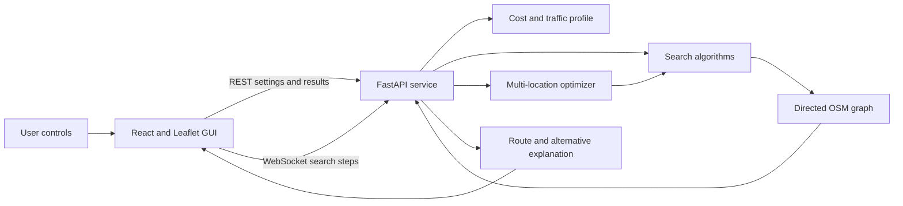
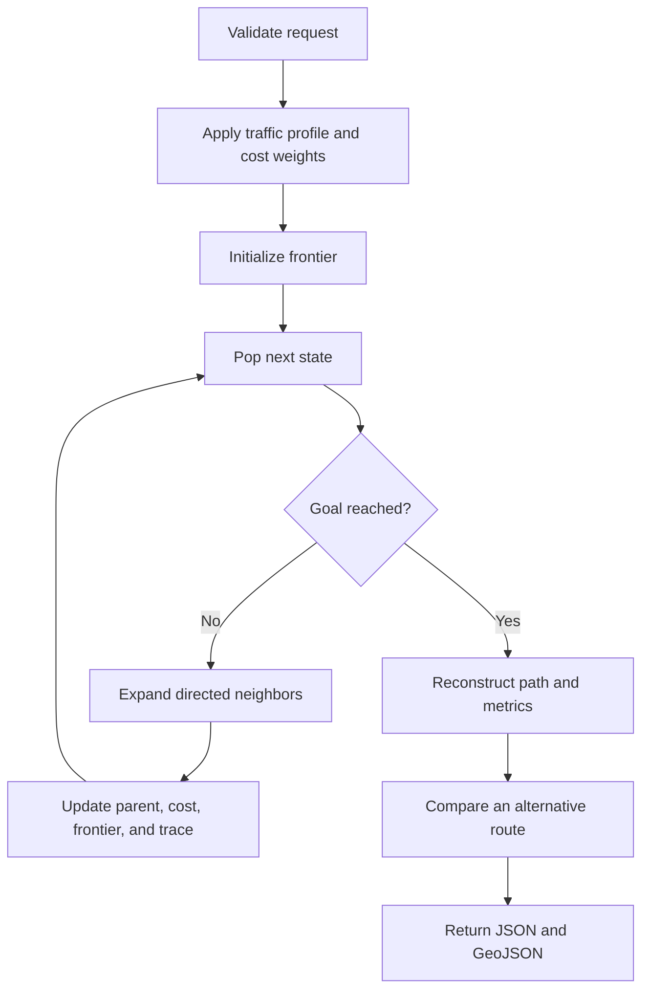
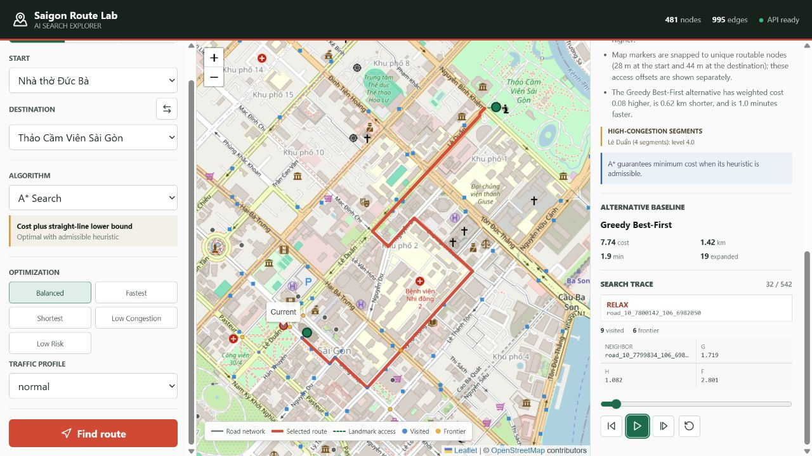
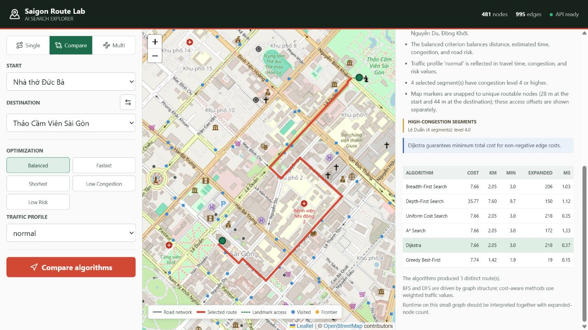
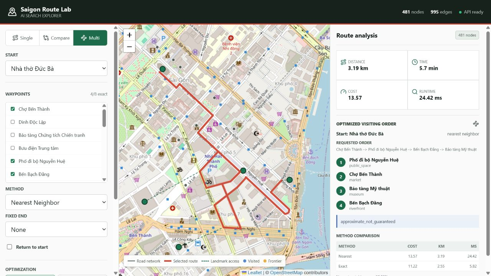

# Saigon Route Lab - Technical Report Source

<!-- Final PDF export requires docs/group_metadata.json with verified values. -->

## 1. Group Introduction

**Project:** Tourist Route Planner for Visiting Multiple Landmarks in Ho Chi
Minh City

**Course:** Introduction to Artificial Intelligence - Lab 1

**Group ID:** `{{GROUP_ID}}`

| Full name | Student ID | Main contribution | Assigned-work completion |
| --- | --- | --- | ---: |
| `{{HOANG_FULL_NAME}}` | `{{HOANG_STUDENT_ID}}` | BFS, Vietnamese traffic context, report introduction | 100% |
| `{{HAU_FULL_NAME}}` | `{{HAU_STUDENT_ID}}` | DFS, graph model, dataset, cost function | 100% |
| `{{TRUNG_FULL_NAME}}` | `{{TRUNG_STUDENT_ID}}` | UCS, route explanation, algorithm analysis | 100% |
| `{{KHANG_FULL_NAME}}` | `{{KHANG_STUDENT_ID}}` | A*, heuristic, GUI and visualization | 100% |
| `{{THAI_KIET_FULL_NAME}}` | `{{THAI_KIET_STUDENT_ID}}` | Dijkstra, Greedy Best-First, multi-location optimization | 100% |

### Requirement completion

| Requirement | Evidence | Status |
| --- | --- | --- |
| Vietnamese traffic scenario | 24 HCMC landmarks and OSM-derived roads | Complete |
| Graph, dataset, cost model | 481 nodes, 995 directed edges, weighted traffic cost | Complete |
| BFS, DFS, UCS, A* | Independent implementations with shared contracts | Complete |
| Two additional algorithms | Dijkstra and Greedy Best-First | Complete |
| Multi-location optimization | Nearest Neighbor and Exact Brute Force | Complete |
| GUI and search animation | React, Leaflet, REST, WebSocket step stream | Complete |
| Route and alternative explanation | Route facts, congestion segments, baseline comparison | Complete |
| Automated verification | 70 unit/integration tests and frontend build | Complete |

## 2. Problem Context

Tourists often want to visit several attractions in central Ho Chi Minh City in
one trip. The physically shortest route may be unsuitable because major roads
can be slow during rush hour, rain can increase travel time and road risk, and
one-way streets constrain movement. The project therefore recommends routes
using distance, estimated travel time, congestion, and risk instead of distance
alone.

The application supports two related tasks:

1. Find a route from one selected landmark to another.
2. Choose an efficient visiting order and complete route for several landmarks.

This is a realistic Vietnamese traffic problem rather than an abstract maze.
Landmark names, road geometry, road classes, and directionality are grounded in
Ho Chi Minh City data.

## 3. Problem Modeling

The traffic network is a directed weighted graph `G = (V, E)`.

- **State:** the current routable road node.
- **Initial state:** the unique road node assigned to the selected start landmark.
- **Goal test:** the current node equals the destination landmark's assigned node.
- **Action/transition:** follow one outgoing directed road edge.
- **Path:** an ordered node sequence connected by valid directed edges.
- **Path cost:** the sum of weighted edge costs.

Each edge stores:

| Field | Unit/range | Meaning |
| --- | --- | --- |
| `distance_km` | km, non-negative | Physical road length |
| `time_min` | minutes, non-negative | Estimated travel time from length and speed |
| `congestion` | 1 to 5 | Scenario traffic level |
| `risk` | 0 to 5 | Penalty derived from road class and weather scenario |
| `road_type` | text | OSM highway class |
| `oneway` | boolean metadata | Whether reverse travel is prohibited |
| `geometry` | coordinate list | Line used by Leaflet to draw the route |

Algorithms never infer reverse edges. A reverse edge exists only when the data
loader provides it.

## 4. Dataset

The source GeoJSON was produced from OpenStreetMap using the group's
`osmnx-tools` repository. The original extracts contain 1,075 directed road
features, 519 intersection records, and approximately 95.083 km of road
geometry. The application normalizes duplicate endpoint pairs, joins two
adjacent major components, and retains the largest strongly connected graph.

| Final graph property | Value |
| --- | ---: |
| Routable nodes | 481 |
| Directed edges | 995 |
| One-way directed edges | 403 |
| Landmarks | 24 |
| Unique assigned landmark nodes | 24 |
| Traffic profiles | 3 |

Every landmark is assigned to a unique nearby routable node so that two
different required stops cannot collapse into one visit. Marker-to-node offsets
are shown as dashed access lines in the GUI. The average offset is about 100 m;
the maximum is 383.5 m for Ben Thanh Market. These offsets are not included in
road-route metrics and are a documented dataset limitation.

The two source boundaries are separately clipped. One bidirectional boundary
link, represented by two directed simulated edges, joins their major road
components. This assumption is labeled `Boundary connector` in route details.

### Landmark list

| Landmark | Category |
| --- | --- |
| Cho Ben Thanh | Market |
| Dinh Doc Lap | Historic site |
| Bao tang Chung tich Chien tranh | Museum |
| Nha tho Duc Ba | Architecture |
| Buu dien Trung tam | Architecture |
| Pho di bo Nguyen Hue | Public space |
| Ben Bach Dang | Riverfront |
| Nha hat Thanh pho | Culture |
| Bao tang Thanh pho Ho Chi Minh | Museum |
| Cong vien Tao Dan | Park |
| Duong sach Thanh pho Ho Chi Minh | Culture |
| Vincom Center Dong Khoi | Shopping |
| Saigon Centre | Shopping |
| Bitexco Financial Tower | Architecture |
| Cong vien Le Van Tam | Park |
| Bao tang My thuat | Museum |
| Nha tho Tan Dinh | Architecture |
| Bao tang Phu nu Nam Bo | Museum |
| Ho Con Rua | Public space |
| Diamond Plaza | Shopping |
| Thao Cam Vien Sai Gon | Park |
| Tru so Uy ban Nhan dan Thanh pho | Architecture |
| Chua Vinh Nghiem | Culture |
| Nha Van hoa Thanh nien | Culture |

## 5. Cost Function and Traffic Conditions

For an edge `e`, the configurable cost is:

```text
C(e) = alpha * distance(e)
     + beta  * time(e)
     + gamma * congestion(e)
     + delta * risk(e)
```

All terms and weights are non-negative. Therefore UCS and Dijkstra satisfy
their non-negative-cost optimality condition.

| Preset | alpha | beta | gamma | delta | Purpose |
| --- | ---: | ---: | ---: | ---: | --- |
| Balanced | 1.00 | 0.40 | 0.08 | 0.12 | Trade off all four factors |
| Fastest | 0.20 | 1.20 | 0.04 | 0.08 | Emphasize estimated time |
| Shortest | 1.50 | 0.05 | 0.01 | 0.03 | Emphasize distance |
| Low congestion | 0.70 | 0.30 | 0.25 | 0.15 | Avoid congested roads |
| Low risk | 0.50 | 0.30 | 0.08 | 0.80 | Avoid higher-risk roads |

The values were selected so differently scaled units all influence the balanced
score while each specialized preset has one clearly dominant term. Users can
also send custom non-negative weights through the API.

The **normal** profile uses base road-class values. **Rush hour** increases time
and congestion, with a larger time multiplier on primary and secondary roads.
**Rainy** increases time, congestion, and risk. These are deterministic hybrid
traffic scenarios, not live sensor measurements.

## 6. Algorithm Principles

The group designed a small test graph with competing routes for unit tests and
video explanation. In that graph, `A -> B -> G` has fewer edges but cost 9,
while `A -> C -> D -> G` has three edges and cost 3. It demonstrates why BFS,
DFS, and weighted search can return different routes.

| Algorithm | Expansion/pop order on the example | Final route | Cost |
| --- | --- | --- | ---: |
| BFS | `A, B, C, G` | `A -> B -> G` | 9 |
| DFS | `A, B, G` | `A -> B -> G` | 9 |
| UCS | `A(0), C(1), D(2), G(3)` by `g` | `A -> C -> D -> G` | 3 |
| A* | `A(2), C(3), D(3), G(3)` by `f=g+h` | `A -> C -> D -> G` | 3 |
| Dijkstra | `A(0), C(1), D(2), G(3)` by distance label | `A -> C -> D -> G` | 3 |
| Greedy | `A(2), B(0), G(0)` by `h` | `A -> B -> G` | 9 |

The complete frontier contents, parent updates, `g`, `h`, and `f` values are
provided in `docs/ALGORITHM_WALKTHROUGH.md` for the presentation and video.

### 6.1 Breadth-First Search

BFS uses a FIFO queue and expands the shallowest discovered node. It is complete
on a finite graph and optimal only by edge count when every action has equal
cost. It does not minimize the traffic cost used by this project.

### 6.2 Depth-First Search

DFS uses a LIFO stack and follows one branch before backtracking. A discovered
set prevents cycles. It is complete on this finite explicit graph but does not
guarantee a short, fast, or low-cost route.

### 6.3 Uniform Cost Search

UCS orders the frontier by accumulated cost `g(n)`. It stops only when the goal
is removed from the priority queue with its best cost. With non-negative edge
costs it is complete and optimal. The implementation is goal-directed.

### 6.4 A* Search

A* orders nodes by `f(n) = g(n) + h(n)`. The service uses:

```text
h(n) = alpha_distance * HaversineDistance(n, goal)
```

Haversine distance never exceeds road distance, and all other cost terms are
non-negative, so this heuristic is admissible. It is also consistent because
the Haversine metric satisfies the triangle inequality and each edge cost is at
least `alpha_distance` times its straight-line displacement. Exhaustive checks
over every graph edge, every landmark goal, and all five presets found zero
consistency violations.

### 6.5 Dijkstra's Algorithm

Dijkstra also expands the lowest accumulated-cost node. In addition to
point-to-point routing, this module exposes a single-source helper used to cache
pairwise paths for multi-location optimization. It is complete and optimal for
non-negative edge costs.

### 6.6 Greedy Best-First Search

Greedy orders the frontier only by `h(n)`. It can expand far fewer nodes, but it
ignores accumulated traffic cost when deciding what to explore. A closed set
ensures termination on the finite graph; route optimality is not guaranteed.

### 6.7 Theoretical comparison

| Algorithm | Worst-case time | Worst-case memory | Complete here | Cost-optimal |
| --- | --- | --- | --- | --- |
| BFS | `O(V + E)` | `O(V)` | Yes | Only by edge count |
| DFS | `O(V + E)` | `O(V)` | Yes, finite graph | No |
| UCS | `O((V + E) log V)` | `O(V)` | Yes | Yes, non-negative cost |
| A* | `O((V + E) log V)` graph bound | `O(V)` | Yes | Yes, admissible heuristic |
| Dijkstra | `O((V + E) log V)` | `O(V)` | Yes | Yes, non-negative cost |
| Greedy | `O((V + E) log V)` | `O(V)` | Yes, finite graph | No |

## 7. Multi-location Optimization

Pairwise shortest paths between important nodes are computed with cached
single-source Dijkstra runs.

- **Nearest Neighbor:** repeatedly visits the currently cheapest unvisited
  waypoint. It is deterministic and efficient but approximate.
- **Exact Brute Force:** evaluates every waypoint permutation when the count is
  at most eight. It guarantees the best ordering for the reduced pairwise
  shortest-path problem and has factorial ordering complexity.

Both methods support a fixed final landmark and returning to the start.
Duplicate waypoints are removed in input order, and unreachable mandatory
segments produce an explicit failure result.

For `k` required waypoints, Nearest Neighbor performs at most `k` selection
rounds after cached pairwise shortest paths and needs `O(k^2)` route-choice
work. Exact Brute Force evaluates `k!` orders, so the GUI limits it to eight
waypoints. Pairwise Dijkstra preprocessing is bounded by the number of
important sources times `O((V + E) log V)`.

## 8. Program Flow and Architecture





Main backend modules:

- `core/osm_loader.py`: graph, geometry, landmarks, traffic profiles.
- `core/contracts.py`: shared edge, step, route, and result contracts.
- `algorithms/`: six independent search entry points.
- `core/multi_location.py`: cached pairwise routing and visiting order.
- `core/explanation.py`: road facts, congestion, optimality, alternatives.
- `core/service.py`: application facade used by REST and WebSocket routes.
- `app/main.py`: FastAPI endpoints.

The GUI consumes only the shared API payloads. It does not reimplement search
logic.

## 9. Experimental Evaluation

The committed benchmark command is:

```powershell
python examples\run_benchmark.py --repeats 10
```

Runtime is the median of ten in-process runs on the development machine. It is
useful for this controlled comparison but is not a universal performance claim.

### 9.1 Algorithm comparison

Scenario: Notre Dame Cathedral to Saigon Zoo, balanced criterion, normal traffic.

| Algorithm | Cost | Distance km | Time min | Expanded | Generated | Median ms |
| --- | ---: | ---: | ---: | ---: | ---: | ---: |
| BFS | 7.661 | 2.046 | 2.977 | 206 | 226 | 0.890 |
| DFS | 35.768 | 7.598 | 9.733 | 150 | 183 | 0.982 |
| UCS | 7.661 | 2.046 | 2.977 | 218 | 244 | 0.294 |
| A* | 7.661 | 2.046 | 2.977 | 172 | 192 | 0.570 |
| Dijkstra | 7.661 | 2.046 | 2.977 | 218 | 244 | 0.292 |
| Greedy | 7.738 | 1.422 | 1.942 | 19 | 37 | 0.135 |

UCS, A*, and Dijkstra agree on the minimum weighted cost. BFS happens to reach
the same route in this case, but that is not its general guarantee. A* expands
46 fewer nodes than UCS/Dijkstra. Greedy expands only 19 nodes and finds a
shorter/faster physical route, but its balanced weighted cost is higher. DFS
returns a much longer and more expensive route.

### 9.2 Effect of traffic conditions

Scenario: Ben Thanh Market to Independence Palace with Dijkstra and balanced
weights.

| Profile | Cost | Distance km | Time min | Path nodes | Route change |
| --- | ---: | ---: | ---: | ---: | --- |
| Normal | 9.365 | 2.140 | 3.223 | 21 | Baseline route |
| Rush hour | 11.834 | 2.140 | 5.394 | 21 | Same roads, higher penalties |
| Rainy | 13.184 | 2.145 | 4.409 | 20 | Changes via Ly Tu Trong/Hai Ba Trung |

Rush hour increases estimated time by about 67% while keeping the selected path
in this case. Rain changes the route and raises the weighted cost because risk
and time penalties alter edge priorities. Across all ordered landmark pairs,
177 of 552 pairs change path in at least one traffic profile.

### 9.3 Multi-location comparison

Start: Notre Dame Cathedral. Requested order: Ben Thanh Market, Nguyen Hue
Walking Street, Bach Dang Wharf, Fine Arts Museum.

| Method/order | Cost | Distance km | Time min | Gap vs exact |
| --- | ---: | ---: | ---: | ---: |
| Original input order | 12.260 | 2.689 | 3.816 | 9.24% |
| Nearest Neighbor | 13.565 | 3.194 | 5.748 | 20.88% |
| Exact Brute Force | 11.223 | 2.552 | 3.647 | 0% |

This case intentionally demonstrates that a local nearest choice can be worse
than both the original input order and the exact order. Exact brute force
improves cost by about 8.46% relative to the requested order. The result is
optimal only for the reduced pairwise problem, not for an unrestricted physical
traveling-salesperson model.

- Nearest Neighbor order: Nguyen Hue Walking Street -> Ben Thanh Market ->
  Fine Arts Museum -> Bach Dang Wharf.
- Exact order: Nguyen Hue Walking Street -> Fine Arts Museum -> Ben Thanh
  Market -> Bach Dang Wharf.

## 10. GUI, Route Explanation, and API

The web GUI supports Single, Compare, and Multi modes. Users choose start,
destination, optional waypoints, algorithm, criterion, and traffic profile.
Leaflet displays the road graph, selected route, landmark access offsets,
visited nodes, frontier nodes, and the current node.

Single results include the graph-node path, named roads, distance, time, cost,
runtime, expanded/generated counts, high-congestion road names, optimality, and
a distinct baseline route comparison. Trace controls expose frontier/visited
counts and step values such as `g`, `h`, `f`, and updated cost.

Compare mode runs all six algorithms under identical settings. Multi mode shows
requested and optimized orders plus Nearest Neighbor and Exact metrics and gap.

| Endpoint | Purpose |
| --- | --- |
| `GET /api/health` | Health and graph dimensions |
| `GET /api/bootstrap` | Landmarks, controls, coordinates, metadata |
| `GET /api/network` | Routable roads as GeoJSON |
| `POST /api/search` | One point-to-point search and alternative |
| `POST /api/compare` | Six algorithms under one scenario |
| `POST /api/multi-route` | Multi-landmark optimization |
| `WS /ws/search` | Live search steps followed by final output |

### Screenshots

Figure 1 shows a single-route result with the selected road path, aggregate
metrics, named congested segments, a distinct alternative, and trace values.



*Figure 1. Single search, route explanation, and `g/h/f` trace detail.*

Figure 2 compares all six algorithms under the same graph, endpoints, cost
criterion, and traffic profile.



*Figure 2. Controlled comparison of BFS, DFS, UCS, A*, Dijkstra, and Greedy.*

Figure 3 shows the requested and optimized landmark orders together with the
Nearest Neighbor versus Exact Brute Force cost gap.



*Figure 3. Multi-landmark optimization; nearest-neighbor gap is 20.88% in this
reproducible case.*

## 11. Installation and Use

Backend:

```powershell
cd lab-1-backend
python -m venv .venv
.\.venv\Scripts\Activate.ps1
python -m pip install -e .
python -m uvicorn app.main:app --host 127.0.0.1 --port 8000
```

Frontend in a second terminal:

```powershell
cd lab-1-frontend
pnpm install
pnpm dev
```

Open `http://127.0.0.1:5173`. For a first example, choose Notre Dame Cathedral,
Saigon Zoo, Dijkstra, balanced, and normal, then select **Find route**. Use the
trace controls to inspect expansion steps. Open Compare for all six algorithms,
or Multi to choose several required landmarks.

## 12. Verification

- 70 backend unit and integration tests pass.
- REST validation and WebSocket streaming are covered.
- Every landmark uses a unique routable node.
- All 552 ordered landmark pairs are reachable.
- UCS, A*, and Dijkstra agree on optimal cost for all 552 pairs.
- The A* service heuristic has zero consistency violations over all graph edges,
  24 landmark goals, and five cost presets.
- The exhaustive claims are reproducible with
  `python examples\run_full_audit.py` in the backend repository.
- Strict TypeScript compilation and the Vite production build pass.
- Desktop and mobile browser workflows have been checked for Single, Compare,
  and Multi modes with a clean console.

## 13. Limitations and Future Work

- Traffic and risk are derived scenarios rather than live measurements.
- Six landmarks are more than 100 m from their assigned road node; the maximum
  access offset is 383.5 m.
- One transparent simulated boundary link joins separate source extracts.
- Exact multi-location search has factorial growth and is capped at eight stops.
- Runtime varies by hardware and browser load.
- The road model does not yet include turn restrictions, traffic signals,
  vehicle classes, or multiple vehicles.

Future work should use one continuous OSM extract covering every landmark,
integrate live traffic and flooding feeds, project landmarks to actual road
edges, support travel modes and turn restrictions, and evaluate over a larger
reproducible scenario suite.

## 14. Conclusion

Saigon Route Lab applies six search strategies to a real Vietnamese map context
under one shared graph and cost model. The implementation demonstrates the
trade-off between uninformed, cost-aware, and heuristic search; explains routes
and alternatives; and extends point-to-point search to exact and approximate
multi-landmark planning. Automated tests and benchmark evidence support the
correctness claims while the documented limitations keep those claims precise.

## 15. References

1. Introduction to Artificial Intelligence, *Lab 1 - Searching*, course
   assignment handout supplied by the instructor.
2. *Tourist Route Planner for Visiting Multiple Landmarks in Ho Chi Minh
   City*, group project specification supplied with the assignment.
3. OpenStreetMap contributors, *Copyright and License*,
   https://www.openstreetmap.org/copyright.
4. Geoff Boeing, *OSMnx: Python for Street Networks*, documentation,
   https://osmnx.readthedocs.io/.
5. Stuart Russell and Peter Norvig, *Artificial Intelligence: A Modern
   Approach*, 4th edition, Pearson, 2021.
